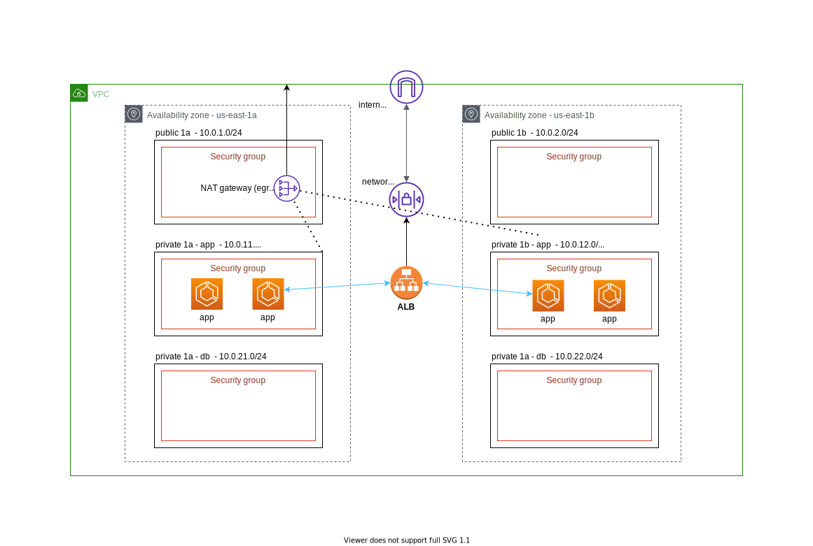

### Next.js on ECS  

This a demo app running on AWS ECS with full CI/CD via github actions deployed to AWS ECR.

- [Architecture](#architecture)
  - [AWS Infrastructure](#infrastructure-aws)
  - [CI/CD workflow](#cicd-workflow)
- [Getting Started](#getting-started)
- [Reference](#reference)
- [Technologies](#technologies)

### Architecture


#### Infrastructure (AWS)



#### CI/CD Workflow

##### CI and initial deployment


##### Continuous delivery (CD) 


**Steps:**  

1. The deployment starts from github actions to trigger the AWS Codedeploy deployment group
2. AWS Codedeploy provisions new ECS tasks and routes 25% of traffic over to new deployment
3. AWS Codedeploy deployment either completes within 10 minutes or rollbacks if set thresholds are exceeded

**Description:**

The continous delivery is leveraging codedeploy to perform a time based blue-green canary.

**Time Interval:** 10 minutes  
**Percentage:** 25%   

So, 25% of the traffic is shifted over to new deployment over an interval of 10 minutes (2 - 3 alarm periods on AWS Cloudwatch).

This setup also includes automatic rollback based on threshold on metrics in cloudwatch (Application load balancer http 5xx, Application errors).

This deployment strategy allows for early error detection while minimizing impact in event of errors and fast rollback with the blue-green approach.

**Note:** The feature is available on the branch [feature-blue-green](https://github.com/Jareechang/ecs-nextjs/tree/feature-blue-green)

### Getting Started

**Running locally:**
```sh
yarn && yarn run dev

Visit http://localhost:3000  
```

**Running locally (docker):**
```sh
docker build -t ecs-nextjs .

docker run -d -p 3000:3000 -e PORT=3000 ecs-nextjs:latest
```

### Infrastructure setup 

**Setup AWS envronment:**
```
terraform init
terraform plan
terraform apply
```

**Setup Github actions:**

The build is defined via the github actions workflow in `.github/workflows/main.yml`

As for the deployment, In order for the deployment pipeline to work you will need the following `secrets` set on your github actions:

| Environment   |  Description |  required  |
|---|---|---|
| AWS_ACCESS_KEY_ID  | AWS access ID  |   Yes |
| AWS_SECRET_ACCESS_KEY  | AWS secret access key  |   Yes |


Once all setup trigger a deployment then visit the link on the ALB (A record).


**Finishing up:**

Remember to run `terraform destroy -auto-approve` once finished with testing.

### Reference

repo is built on [example-nextjs-emotion11-material-u](https://github.com/Jareechang/example-nextjs-emotion11-material-ui) and [tf-modules](https://github.com/Jareechang/tf-modules).

[Basic Final Next.js](https://github.com/vercel/next-learn-starter/tree/master/basics-final)

### Technologies

- [emotion](https://emotion.sh/docs/@emotion/css) @ 11.0
- [material-ui](https://material-ui.com/) @ 4.11
- [next](https://nextjs.org/docs/getting-started) @ 10.x
- [polished](https://polished.js.org/docs/) @ 4.x
- terraform
- AWS ECS 
- AWS ECR
- AWS VPC (subnets, route table, netowrk acl, igw, nat gw)
- AWS SSM
- AWS ALB
